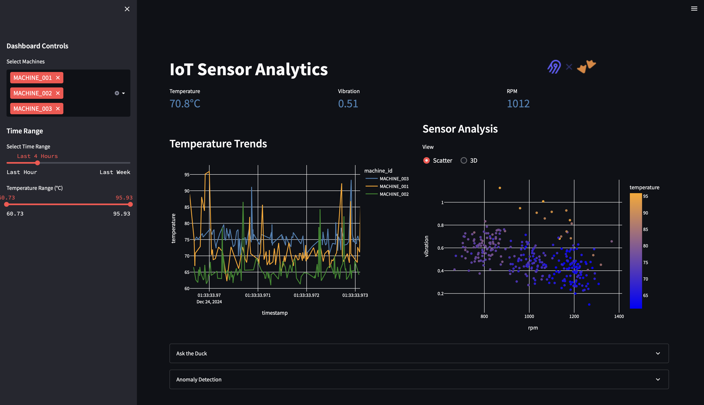
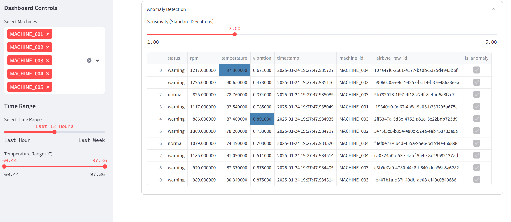

# Industrial IoT Analytics Platform

<div align="center">
  
</div>

Industrial IoT sensor monitoring and analytics platform demonstrating modern data stack integration using FastAPI, Airbyte, and Postgres.

## Technical Implementation
The solution simulates an industrial IoT environment where sensor data is collected and analyzed in mini batches:

- **Edge Layer**: FastAPI simulates IoT sensors, generating realistic machine data (temperature, vibration, RPM) with configurable anomaly rates
- **Ingestion**: Airbyte Local/Cloud handles real-time data ingestion from the API endpoint
- **Storage & Analytics**: Postgres (DB) provides data warehouse capabilities 
- **Visualization**: Streamlit powers an interactive monitoring dashboard

In production environments, data would typically flow through MQTT protocols via edge gateways into cloud message brokers (like AWS IoT Core or Azure IoT Hub) for buffering before ingestion. This demo simplifies the architecture while maintaining realistic data patterns and API-based ingestion.

## Dashboard Preview
<div align="center">
  
  
</div>

## Dataset
The simulated industrial IoT dataset includes:
- 5 unique machines with distinct baseline characteristics
- Real-time sensor readings:
  - Temperature (°C)
  - Vibration (mm/s)
  - RPM
- 5% anomaly injection rate
- Machine status tracking (normal/warning)
- Time-series data with millisecond precision

## Setup Instructions
### Prerequisites
- Python 3.9+
- Airbyte Local/Cloud account
- Postgres

### Environment Setup
```bash
# Create virtual environment
Python -m venv .venv

# Activate virtual Environment
source .venv/bin/activate
# Install dependencies
pip install -r requirements.txt

# Install other libraries as per you requirements for DB and Visualization
psycopg2
plotly
```

Create a `.env` file:
```env
# For Streamlit dashboard
HOST=your_host_here
DB=your_DB_here
DB_PASSWORD=your_DB_PASSWORD_here
DB_USER=your_DB_USER_here
```

### Running the Application
1. Start FastAPI Simulator:
```bash
python edge_gateway.py
```

3. Configure Airbyte:
   - Create custom HTTP source using Builder
   - Set Postgres as destination
   - Configure sync frequency (minimum 60 minutes)

4. Launch dashboard:
```bash
streamlit run app.py
```
## Features
- Real-time sensor monitoring
- Automated data ingestion
- Interactive analytics dashboard
- Anomaly detection
- Time-series visualizations

## Future Enhancements
- MQTT protocol integration
- ML anomaly detection
- Predictive maintenance
- Additional sensor types

## Contributing
Feel free to submit issues and enhancement requests!